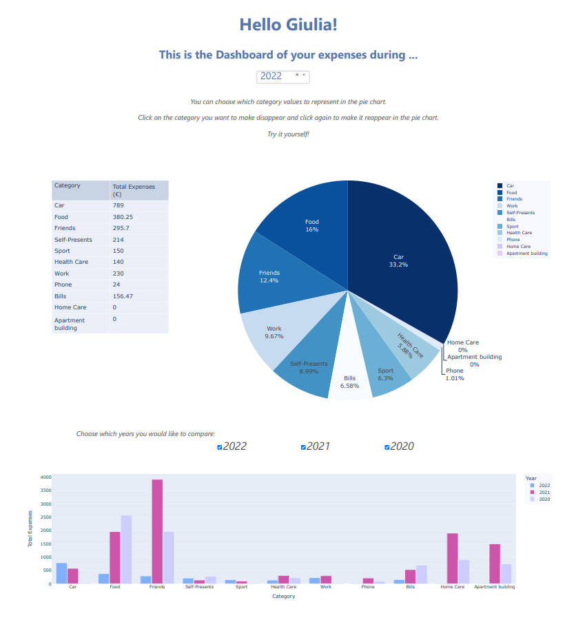

# App_to_Track_your_Expenses
This is an application for tracking your expenses created by Giulia Gualtieri.  

## Table of contents
* [Introduction](#introduction)
* [Technologies](#technologies)
* [Run the app](#run-the-app)
* [Project Status](#project-status)
* [Contact](#contact)

## Introduction
I've developed the application with Dash Python library. I also add a css file, thus the knowledge of HTML and CSS was required for implementing some custom features.  
By using Dash, I've created this cool and fancy application to analyze the total expenses among different years.



## Technologies
The project is created with:  
- Python: 3.10
- Dash library: 2.2.0

## Run the app
First of all, install a virtual environtment using `pip install virtualenv`. See the documentation at https://docs.python.org/3/library/venv.html.  
Then create an venv space, activate it, install the dependencies and run the `app.py`.
```
git clone https://github.com/GiuliaGualtieri/App_to_Track_your_Expenses
cd App_to_Track_your_Expenses
py -m env
Scripts/activate
pip install -r requirements.txt
py app.py
```  

Pay attention: you should to run command lines depending on which version of Python you have. In this case is `py`, but if you have a version of Python previous than the 3.10.

## Project Status
It'_working in progress_ project. Several things I desire to add. Thus, if you are trying the app and you have some suggestions to forward me, let me know. I would appreciate them ([view contact chapter](#contact)).  

My actuals developing points are the followings:  
- add a line chart where on x-axis there are the months and on y-axis there are the total expenses. The plot has a line for each year;  
- similar as the plot above, I would like to add line chart where on x-axis there are the months and on y-axis there are the total expenses, but this time the figure has a line for eahc cathegory and the user can choose which year wants to show.


## Contact
My email: giulia-gualtieri@alice.it
